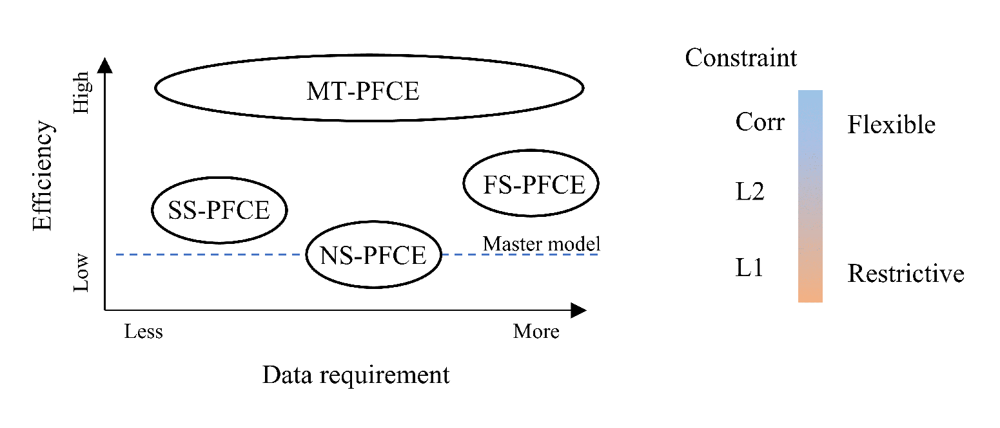

# PFCE: A Parameter-Free Framework for Calibration Enhancement of Near-Infrared Spectroscopy

PFCE is a versatile parameter-free calibration enhancement framework designed for near-infrared (NIR) spectra. This framework is capable of addressing the inconsistency issue in NIR spectra and maintaining the prediction ability of the calibration model under different conditions. 

## Available Methods

The following methods are included in the PFCE framework:

- Non-supervised PFCE (NS-PFCE)
- Semi-supervised PFCE (SS-PFCE)
- Full-supervised PFCE (FS-PFCE)
- Multi-temporal PFCE (MT-PFCE)

### Non-supervised PFCE (NS-PFCE)

NS-PFCE makes use of both the provided master and slave spectra of standard samples to construct a maintained calibration slave model by implementing a correlation constraint on the regression coefficients. This method is suitable for cases where both master and slave standard spectra are available, but no reference information of the standard samples is provided.

### Semi-supervised PFCE (SS-PFCE)

SS-PFCE integrates the slave spectra and reference information of standard samples into the slave spectral calibration. This method can be used when just slave spectra and reference information of a batch of samples are available. 

### Full-supervised PFCE (FS-PFCE)

FS-PFCE is similar to NS-PFCE, but the reference information of the standard samples is also included in the construction of the slave model. This method is appropriate when reference information is available for both the master and slave spectra.

### Multi-temporal PFCE (MT-PFCE)

MT-PFCE is designed for the most general scenario where multiple instruments require calibration enhancement. This method can be used to simultaneously enhance the calibration of both the master and slave models. MT-PFCE can be adapted to a wide range of scenarios, such as SS-PFCE or FS-PFCE, by adjusting the conditions for the master model. Additionally, this method has the potential to model data with inherent hierarchical structures, similar to pre-training and fine-tuning in deep learning. This is an area for future work.

## Required Data

- Non-supervised PFCE (NS-PFCE): Master spectra and slave spectra from the same batch of standard samples
- Semi-supervised PFCE (SS-PFCE): Slave spectra and the corresponding reference information from a batch of samples
- Full-supervised PFCE (FS-PFCE): Master spectra, slave spectra, and the corresponding reference information of batch of standard samples
- Multi-temporal PFCE (MT-PFCE):  Spectra and corresponding reference information for each task, not necessarily from the same batch of samples.

## Usage

### Matlab

1. First clone this repository locally, e.g. by running `git clone https://github.com/JinZhangLab/PFCE` from xshell in Windows system

2. Then go to the PFCE path and execute the `demo_tablet.m` script in the Matlab environment.

### Python

All the latest features of PFCE are now available in the python package [pynir](https://pypi.org/project/pynir/). 

1. You just need to install it by run `pip install pynir` in your bash environment.

2. Then clone the pynir repository by runing `git clone https://github.com/JinZhangLab/pynir` in your bash environment. 

3. Finally, refer to `Demo11_calibrationTransfer_PFCE_Tablet.py` in tests subfold for the demonstration of PFCE with tablet dataset.

### online

An online calibration platform for NIR spectroscopy, [nir.chemoinfolab.com](https://nir.chemoinfolab.com), enables the use of some simple functions of PFCE.

## Successful applications

| Method                | Application                                                                                                                     | Reference                                                                                                                          |
| --------------------- | ------------------------------------------------------------------------------------------------------------------------------- | ---------------------------------------------------------------------------------------------------------------------------------- |
| SS-PFCE               | Batch-to-batch variability of fruit samples in portable spectroscopy                                                            | [Mishra, et al., 2021](https://www.sciencedirect.com/science/article/pii/S0003267021005973)                                        |
| NS- and SS-PFCE       | Calibration transfer from point spectrometers to visible/near-infrared spectral imaging machines                                | [Mishra, et al., 2021](https://www.sciencedirect.com/science/article/pii/S0003267021009806)                                        |
| SS-PFCE               | Baseline for the deep transfer leanring of NIR spectral calibration of mango dry matter and melamine turbidity point prediction | [Mishra, 2021](https://www.sciencedirect.com/science/article/pii/S0169743921000514)                                                |
| NS-PFCE               | Correct the effects of moisture and material scattering on tobacol NIR spectra                                                  | [Geng, et al., 2022](https://www.sciencedirect.com/science/article/abs/pii/S0026265X22006257)                                      |
| SS-PFCE               | Correct the variation in tobacol NIR spectra with dection time                                                                  | [Geng, et al, 2022](http://www.fxcsxb.com/fxcsxb/ch/reader/create_pdf.aspx?file_no=20220714&flag=1&journal_id=fxcsxb&year_id=2022) |
| SS-PFCE               | Correct the variation in soil NIR spectra with dection time                                                                     | [Zhang, et al, 2022](http://www.analchem.cn/article/doi/10.19756/j.issn.0253-3820.211236)                                          |
| NS-, SS-, and FS-PFCE | A graphical user interface to perform calibration transfer for multivariate calibrations                                        | [Mishra, et al., 2021](https://www.sciencedirect.com/science/article/pii/S0169743921001064)                                        |
| NS-PFCE               | Calibration for NIR spectra of non-homogeneous tobacco samples for non-destructive and rapid analysis                           | [Geng, et al., 2023](https://doi.org/10.1039/D2AY01805E)                                                                           |
| SS-PFCE | Calibration transfer of Near-Infrared Spectra for Soluble Solids Content Prediction across Different Fruits |  [Guo, et al., 2023](https://www.mdpi.com/2076-3417/13/9/5417)|

## Change log

- 1.0 - Nov 1, 2020
  - The first version of PFCE, include three methods, NS-, SS- and FS-PFCE with Corr constrinat.
- 2.0 - April 3, 2023
  - The second version of PFCE, namely PFCE2, include two new constraints, L2 and L1, as well as a new method, MT-PFCE.

## Citation

If you find this method useful in your research, we kindly ask that you cite the following paper:

[1] Zhang J., Zhou X., Li B. PFCE2: A versatile parameter-free calibration enhancement framework for near-infrared spectroscopy [J]. Spectrochimica Acta Part A: Molecular and Biomolecular Spectroscopy, 2023, 301: 122978. https://doi.org/10.1016/j.saa.2023.122978
[2] J Zhang, BY Li, Y Hu, et. al. A Parameter-Free Framework for Calibration Enhancement of Near-Infrared Spectroscopy Based on Correlation Constraint, analytica chimica acta, 2021, 1142: 169-178. https://doi.org/10.1016/j.aca.2020.11.006

## Contact

If you have any questions or comments about PFCE, please [contact us](mailto:zhangjin@mail.nankai.edu.cn). We welcome feedback and suggestions for improvement!
